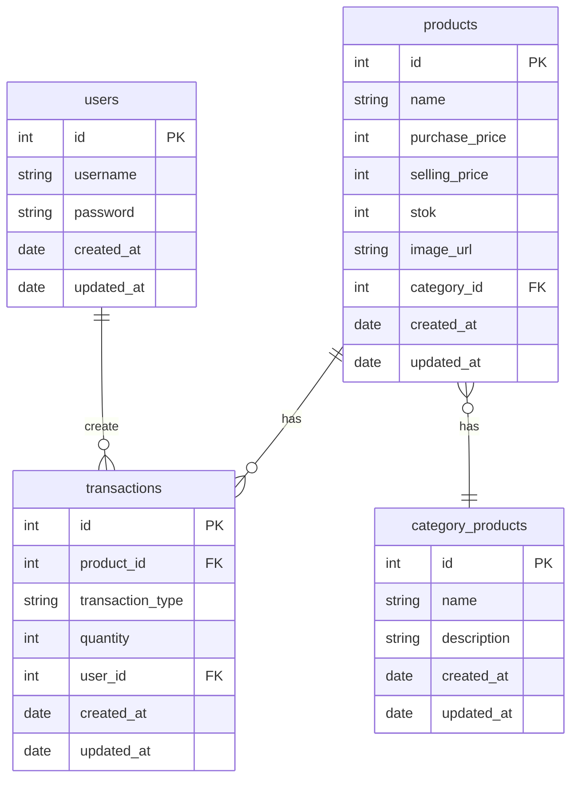

```mermaid
erDiagram
    users {
        int id PK
        string username
        string password
        date created_at
        date updated_at
    }
    products {
        int id PK
        string name
        int purchase_price
        int selling_price
        int stok
        string image_url
        int category_id FK
        date created_at
        date updated_at
    }
    category_products {
        int id PK
        string name
        string description
        date created_at
        date updated_at
    }
    transactions {
        int id PK
        int product_id FK
        string transaction_type
        int quantity
        int user_id FK
        date created_at
        date updated_at
    }
    users ||--o{ transactions : create
    products ||--o{ transactions : has
    products }o--|| category_products : has

```
