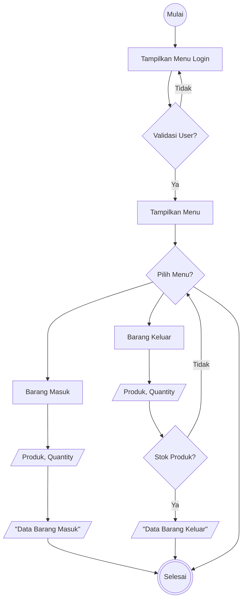

```mermaid
flowchart TD
    Mulai@{ shape: circle, label: "Mulai" }
    Login@{ shape: rect, label: "Tampilkan Menu Login" }
    ValidasiLogin@{ shape: diamond, label: "Validasi User?" }
    TampilMenu@{ shape: rect, label: "Tampilkan Menu" }
    PilihMenu@{ shape: diamond, label: "Pilih Menu?" }
    BarangKeluar@{ shape: rect, label: "Barang Keluar"}
    BarangMasuk@{ shape: rect, label: "Barang Masuk"}
    InputBarangKuantitas@{ shape: lean-r, label: "Produk, Quantity" }
    InputBarangKuantitas2@{ shape: lean-r, label: "Produk, Quantity" }
    CekStok@{ shape: diamond, label: "Stok Produk?" }
    OutputBarangMasuk@{ shape: lean-r, label: '"Data Barang Masuk"' }
    OutputBarangKeluar@{ shape: lean-r, label: '"Data Barang Keluar"' }

    Selesai@{ shape: dbl-circ, label: "Selesai" }

    Mulai --> Login --> ValidasiLogin
    ValidasiLogin --Tidak--> Login
    ValidasiLogin --Ya--> TampilMenu
    TampilMenu --> PilihMenu
    PilihMenu --> BarangMasuk
    PilihMenu --> BarangKeluar
    BarangMasuk --> InputBarangKuantitas --> OutputBarangMasuk
    BarangKeluar --> InputBarangKuantitas2 --> CekStok
    OutputBarangMasuk --> Selesai
    CekStok --Ya--> OutputBarangKeluar --> Selesai
    CekStok --Tidak--> PilihMenu
    PilihMenu --> Selesai


```
