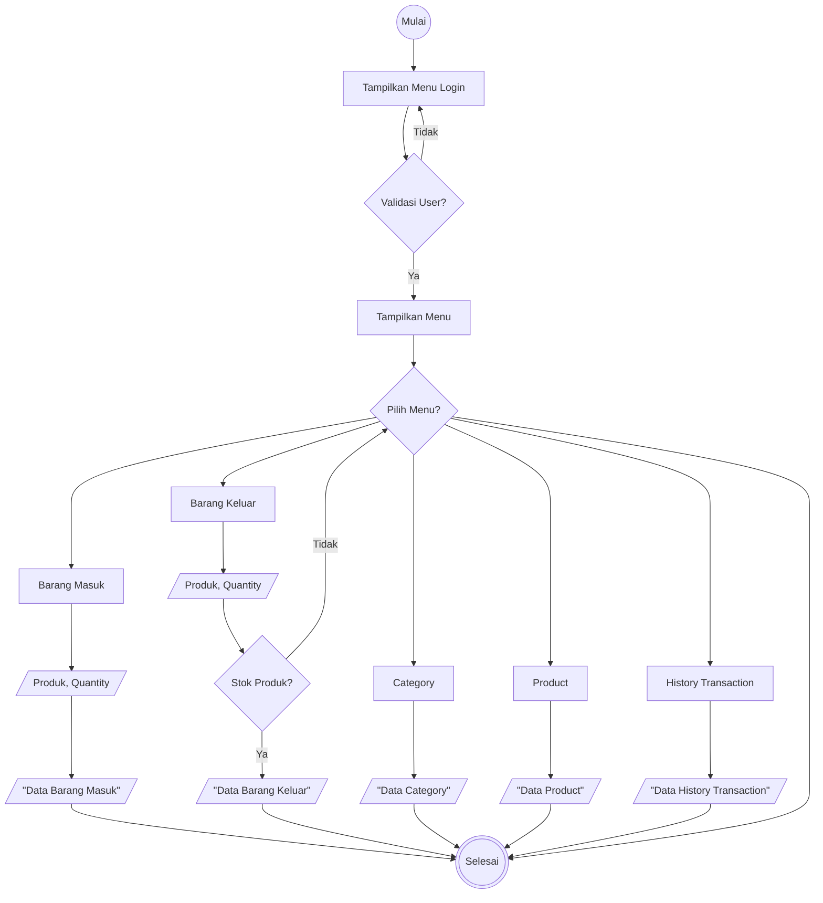
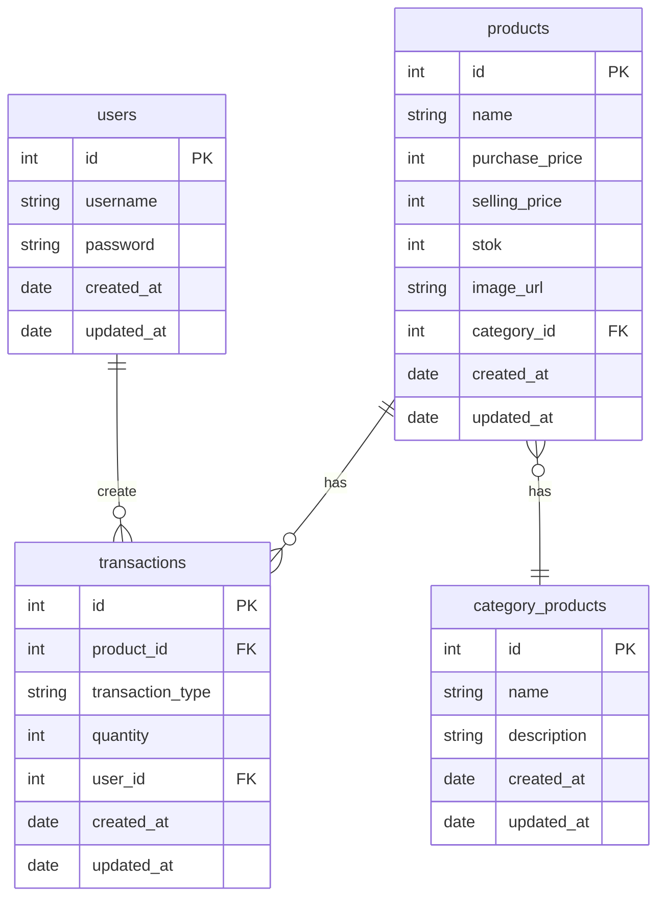

# Go Backend Inventory

## How to Run this Project

1. Create a new empty directory for the project and navigate into it
2. Clone this project into the empty current directory:

```
git clone https://github.com/yusufbahtiarr/fgo24-phase3.git .
```

3. Install dependencies

```
go mod tidy
```

4. Run the project

```
go run main.go
```

## User Requirment

| No  | Feature                    | Description                                                                                                                                                                                                                                |
| --- | -------------------------- | ------------------------------------------------------------------------------------------------------------------------------------------------------------------------------------------------------------------------------------------ |
| 1   | User Login                 | Users can log in using their credentials to access and manage inventory features. Authentication is required to protect access to stock and transaction data.                                                                              |
| 2   | View Product Categories    | Users can view a list of product categories, including the category name and description. seeding.                                                                                                                                         |
| 3   | View Product List          | Users can view all products including: product name, image (URL), category, purchase price, selling price, and available stock.                                                                                                            |
| 4   | Product Stock Transactions | Admin can record stock transactions, both incoming (stock in) and outgoing (stock out). Incoming transactions increase product stock, while outgoing transactions decrease it — ensuring the quantity does not exceed the available stock. |
| 5   | Transaction History        | Users can view all transaction history with details:transaction id, product id, product name, category, quantity in, quantity out, purchase price, selling price, total purchase value, total sales value, and current stock availability. |

## Flowchart



### Entity Relationship Diagram



## Endpoints Overview

| Method | Endpoint                | Description                                      | Auth |
| ------ | ----------------------- | ------------------------------------------------ | ---- |
| POST   | /users/login            | Login                                            | No   |
| GET    | /products               | Retrieves list of products                       | Yes  |
| GET    | /products/category      | Retrieves list of product categories             | Yes  |
| POST   | /inventory/transactions | Create a new transaction (stock-in or stock-out) | Yes  |
| GET    | /inventory/transactions | Retrieves transactions history                   | Yes  |

## Dependencies

- Gin Gonic : Used to build REST APIs, manage routes, handle HTTP requests/responses, and apply middleware.
- JWT (JSON Web Token) : Used for creating and verifying tokens for user authentication and authorization.
- Pgx (PostgreSQL driver) : Used to connect to a PostgreSQL database and run SQL queries.
- Godotenv : Loads environment variables from a .env file into the app.
- Argon2 : Used for securely hashing and verifying passwords.
